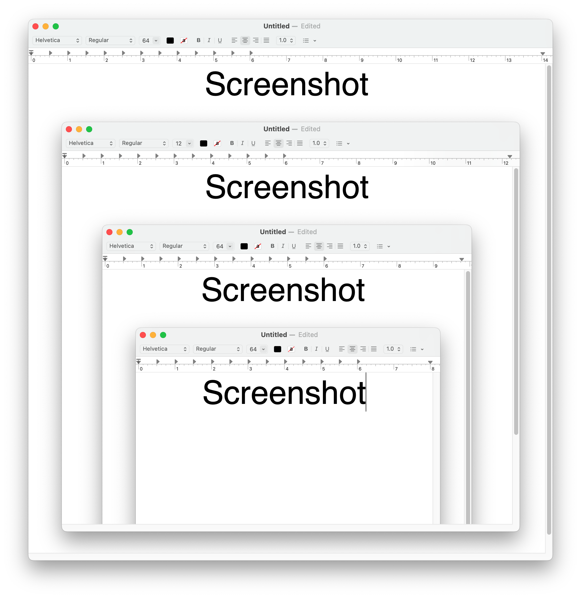
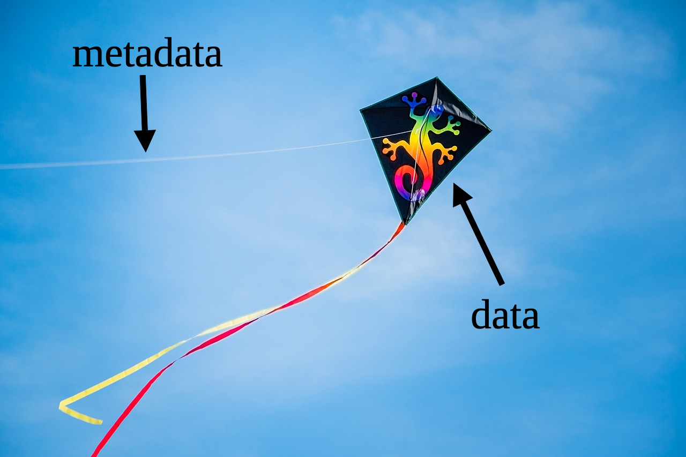
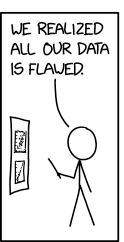
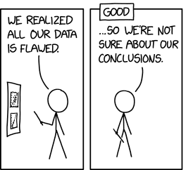
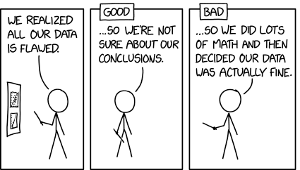
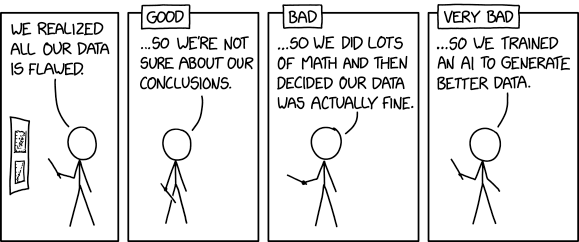

# KI-Datenanalyse in der Religionswissenschaft

### Wie sollen unterschiedliche Datentypen und -strukturen berücksichtigt werden?

Wintersemester 2025/2026
Prof. Dr. Nathan Gibson

<!--  -->

## Gliederung: Teil II

### Arbeiten mit Daten (05.12.)
  
- 7) 14:15-15:45	Datentypen und -strukturen  
- 8) 16:15-17:45	Anpassungen für religionswissenschaftliche Daten  

### Programmieren mit KI (06.12.)

#### Datenreinigung und Datenanalyse programmieren

- 9) 10:15-11:15	(**Frühstücksstunde in IG 6.552**) Begriffe  
- 10) 11:30-12:30 & 13:00-13:45	Übungen (**Mittagspause** ca. 12:30–13:00)  

#### Datenvisualisierung programmieren

- 11) 14:15-15:15	Begriffe  
- 12) 15:45-17:45	Übungen, Abschlussdiskussion & Lehrevaluation  

## 📈 Rückblick

<!-- jeopardy? "Bist du sicher?" "KI & ReWi" "LLMs & M&Ms" "Termini technici" -->

## Ethische Stellungnahmen

Was würdest du mit KI machen:

- lokal auf deinem Rechner?
- mit LobeChat von der Uni?
- mit ChatGPT, Gemini usw.?

## Einleitung: Datentypen und -strukturen

Bevor du backen kannst, müsst du die Arten von Zutaten verstehen ...

## Heutiges Lernziel

Datentypen und Datenstrukturen grundlegend verstehen.

## Chocolate Model

| {: height="300px" .fragment} | {: height="300px" .fragment} | {: height="300px" .fragment} | {: height="300px" .fragment} |
| **Pick** | **Prepare** | **Process** | **Package** |
| Collecting sources (Inputs) | Structuring data | Analysis, Results (Outputs) | Presentation |
| Manuscripts, Photos, Interviews | Transcribing, Collating | Textual comparison, criticism, content analysis, coding | Edition, Narrative, Thematic discussion, Interactive website |

## Datentypen

1. Text
2. Datenbanken
3. Bilder
4. Audio/Video
5. Big Data
6. Metadaten (& FAIR-Prinzipien)

## Which of these is text from the computer's perspective?

a. Text
{: style="font-size: larger"}

b. Very fancy
{: style="font-family: 'rothenburg_decorativenormal'; font-size: larger"}

c. Backwards
{: style="transform: rotateY(180deg); font-size: larger"}

d. Emojis 🦉👀🐁❤️🐛
{: style="font-size: larger"}

e. Invisible character‎
{: style="font-size: larger"}

f. Math equation 𝓐 = 4𝛑𝑟²
{: style="font-size: larger"}

## Which of these is text from the computer's perspective? (continued)

g. Arabic عربيّة
{: style="font-size: larger"}

h. Domino game 🁍🀱🀲🀺🁃
{: style="font-size: larger"}

i. Hieroglyphics (version 1): 
{: style="font-size: larger"}
{: style="width: 200px; margin: auto"}

j. Hieroglyphics (version 2):  
𐦐𐦗𓂅𓂧𓂋𐦉𓂂𐦇𓂂𓂑𐦓
{: style="font-size: larger"}

## Which of these is text from the computer's perspective? (continued)

k. Screenshot
{: style="font-size: larger"}
{: style="width: 200px; margin: auto"}

l. Page scan
{: style="font-size: larger"}
{: style="width: 200px; margin: auto"}

## Even this is text

⠀⠀⠀⠀⠀⠀⠀⠀⢀⣴⣾⣿⣷⣾⣿⣿⣿⣷⣤⣤⣀⡀⠀⠀⠀⠀⠀⠀⠀⠀
⠀⠀⠀⠀⠀⠀⢀⣤⣿⣿⣷⣢⣌⣭⣍⢻⣿⡟⣽⣿⣿⣿⣦⠀⠀⠀⠀⠀⠀⠀
⠀⠀⠀⠀⠀⠀⣾⣿⠟⣷⡾⠛⠋⠉⠛⠛⠛⢷⣉⣭⣿⣿⣿⡀⠀⠀⠀⠀⠀⠀
⠀⠀⠀⠀⠀⢾⣿⣿⣿⣿⠁⠀⠀⠀⠀⠀⠀⠀⣿⣷⡌⣿⣿⣷⠀⠀⠀⠀⠀⠀
⠀⠀⠀⠀⠀⣸⣿⣿⣿⡟⠀⢀⡀⠀⠀⠀⢀⣀⢹⣿⡿⢿⣿⣿⠀⠀⠀⠀⠀⠀
⠀⠀⠀⠀⠀⣿⣿⣿⣿⡇⣎⢥⣿⣷⡄⣾⣿⣭⢽⣿⡇⣾⣿⣿⡄⠀⠀⠀⠀⠀
⠀⠀⠀⠀⢀⣿⠻⢟⣿⠇⠈⠋⠁⢹⡀⣿⡇⠹⠟⣿⣿⣮⣤⣾⣿⠀⠀⠀⠀⠀
⠀⠀⠀⠀⠈⢿⣷⣿⢿⣠⠀⠀⠀⣤⡄⣻⡧⠀⠀⣿⣿⡟⠿⠿⠃⠀⠀⠀⠀⠀
⠀⠀⠀⠀⠀⠀⢀⣴⣿⣿⡄⠀⠠⣤⢌⠭⣥⢀⣼⣿⣿⣿⣷⣄⠀⠀⠀⠀⠀⠀
⠀⠀⠀⠀⠀⠀⢺⣿⣿⣿⠋⢦⡀⠐⠓⠒⣿⣿⣿⠿⣿⣿⣿⠏⠀⠀⠀⠀⠀⠀
⠀⠀⠀⠀⠀⠀⠀⢹⣿⣿⣆⠈⠻⢶⣶⣾⡿⠟⠁⢀⣿⣿⡟⠀⠀⠀⠀⠀⠀⠀
⠀⠀⠀⢀⣠⣴⣾⣿⣯⢿⣏⢦⡀⠀⣰⢧⡀⠀⣠⡞⣿⣿⣿⣷⣦⣄⡀⠀⠀⠀
⠀⣤⣾⣿⣿⣿⣿⣿⣿⣷⡻⣦⡉⢿⢭⡞⣻⠿⢋⣼⣿⣿⣿⣿⣿⣿⣿⣷⣦⠀
⣼⣿⣿⣿⣿⣿⣿⣿⣿⣿⣿⣿⣿⣿⣷⣿⣿⣷⣿⣿⣿⣿⣿⣿⣿⣿⣿⣿⣿⣧
⠻⠿⠿⠿⠿⠿⠿⠿⠿⠿⠿⠿⠿⠿⠿⠿⠿⠿⠿⠿⠿⠿⠿⠿⠿⠿⠿⠿⠿⠿

## There are 10 types of people in the world ... 

### ... Those who understand binary, and those who don't.
{: .fragment}

{: style="width: 500px" .fragment}

<figcaption>By <a href="https://en.wikipedia.org/wiki/User:Vanessaezekowitz" class="extiw" title="wikipedia:User:Vanessaezekowitz">Vanessaezekowitz</a> at <a href="https://en.wikipedia.org/wiki/" class="extiw" title="wikipedia:">English Wikipedia</a>, <a href="https://creativecommons.org/licenses/by-sa/3.0" title="Creative Commons Attribution-Share Alike 3.0">CC BY-SA 3.0</a>, <a href="https://commons.wikimedia.org/w/index.php?curid=32927184">Link</a></figcaption>

## The importance of text in computing

Text as the most important unit of human-machine interaction

- communication
- programming
- websites

## The importance of text in digital humanities

Many humanistic disciplines such as history, philology, literature, theology, and anthropology primarily use _textual_ sources.

Many humanistic disciplines also do their analysis and communicate their results using primarily text.

## But the world is not text!

- Can and should the thing I want to study be represented as text? 
  - An ancient manuscript?
  - A work of art?
  - A musical work?
  - An interview?
  - Archeological findings?
  - Polling/survey responses?

## "Plain Text"

Text without formatting:

Plain text

_Formatted_ **text**

Even crazier formatted text!
{: style="transform: rotateY(180deg); font-family: 'NewtSerifLight-Italic'; font-size: larger"}

## "Plain Text"

Plain text can be opened in _any_ text program. Microsoft Word, Notepad, TextEdit, even a web browser. <a href="../assets/downloads/plaintext.txt" download>Try it!</a>

You might see ".txt" on the end of a plain text file, but actually the file extension doesn't really matter. <a href="../assets/downloads/plaintext.whateveryoulike" download>Try it!</a>

## "Plain Text"

But plain text still has an "encoding."

Arabic in an old encoding (Windows-1256) <a href="../assets/downloads/arabic-windows1256.txt" download>Try it!</a>

Arabic in Unicode (UTF-8) <a href="../assets/downloads/arabic-utf8.txt" download>Try it!</a>

## Mehr über Textdateien

- [Regular Expressions (RegEx)](https://24data.pages.gwdg.de/2-slides#/what-are-regular-expressions-regex)
- [Markdown & Markup](https://24data.pages.gwdg.de/4-slides#/what-is-markdown)
- [HTML vs. XML](https://24data.pages.gwdg.de/5-slides#/13--html-vs-xml-as-markup-html)

## Datenbanken: Entities & Relationships: Cat in the Hat



Thing 1 > does _x_ to > Thing 2

## Entities & Relationships: What are they?

- **_entity_**: a thing in a database "with an identity independent of change to its attributes" ([Wikipedia](https://en.wikipedia.org/wiki/Entity#In_computer_science))
- **_attribute_**: information about about an entity
- **_relationship_**: statements linking entities

## Databases: What are they?



<figcaption>By Internet Archive Book Images - <a rel="nofollow" class="external free" href="https://www.flickr.com/photos/internetarchivebookimages/14781001892/">https://www.flickr.com/photos/internetarchivebookimages/14781001892/</a>, <a href="https://www.flickr.com/commons/usage/" title="No known copyright restrictions">No restrictions</a>, <a href="https://commons.wikimedia.org/w/index.php?curid=80838918">Link</a>, By <a href="//commons.wikimedia.org/wiki/User:ArnoldReinhold" title="User:ArnoldReinhold">ArnoldReinhold</a> - Own work, <a href="https://creativecommons.org/licenses/by/2.5" title="Creative Commons Attribution 2.5">CC BY 2.5</a>, <a href="https://commons.wikimedia.org/w/index.php?curid=486420">Link</a></figcaption>

## Databases: What are they?

Tables of relationships _or_ a model of the universe

## Database Formats

Spreadsheet | Relational Database | XML | JSON
-- | -- | -- | --
easy to create & edit | best for high-performance web apps | durable & transportable | great for connecting web apps

## Bilder

grundsätzlich binär (1000101010010110101...) (.BMP)

dazu Kompressionsalgorithmen (.JPG, .PNG, usw.)

## Image processing principles: Questions to ask

- Purpose
- Source
- Access
- Format
- Manual or automatic processing

## Image processing principles: Tasks

- classification
- object recognition (incl. facial recognition)
- text recognition
- color recognition
- spatial dimensions

## Audio & Video

grundsätzlich binär (z.B. .WAV)

dazu Kompressionsalgorithmen bzw. Codecs (.MP3, .MP4, usw.)

## Processing Audio & Video: Sources & Formats

Where might you get audio and video from? What formats might it be in?

- digitized/not digitized?
- length?
- speakers?
- quality?
- encoding?

## Processing Audio & Video: Analysis Goals

What do you want to _do_ with your audio/video files? 

Does it relate to ...
- words/text?
- music/sound?
- visual?
- connection between these?

## Processing Audio & Video: Target Data & Metadata Formats

What information do you need to generate or tag to do this analysis? What format do the media files ultimately need to be in?

- logs of files?
- timestamps of scenes?
- frame-grabs?
- encoding?

## Processing Audio & Video: Tools

Two especially important tools:

- [WhisperAI](https://github.com/openai/whisper) for transcribing audio
- [FFMPEG](https://ffmpeg.org/): command-line utility for converting and sampling video and audio

## Big Data 

**Big Data:** _Data that defies "traditional methods" of processing or analysis because of its large scale_.

Examples:
- The Facebook Graph: ca. 3 billion users (and the relationships between them!)
- GPT-3 training data: 500 billion words

## Big Data 

Meistens nicht homogen!

## Metadaten & FAIR

## Metadata: What is it?

Metadata is _data about your data_. 

## Metadata: File metadata

On your computer, you might typically see this information about files:
- all files: date created, date modified, size, file type
- photos & videos: dimensions, location, camera settings
- audio & videos: playback length, encoding
- PDFs: number of pages

## Metadata: Research metadata

But _you_ can decide more things you want to add to your metadata. 

Research metadata should typically include
- _who_ created/entered the data
- _how_ the data was processed
- _according to_ which guidelines

as well as _version information_ for any specific package that is being made available. 

## Metadata: Version information

Version information includes
- release date of the current version
- version number (e.g. "1.12", for "Semantic Versioning" see <https://semver.org/>)
- changes since the last version

## Metadata: Examples

Information you might include depending on the type of data:
- texts: language, author, date composed, number of lines, text encoding
- tables: what the columns are, what they mean, what each row represents
- databases: structure of tables, fields, and relationships
- images/audio/video: what steps and software features were used to process them 

## Metadata: How to include it

Check what is standard for the type of data you have. For example, 

- A README.txt (or README.md) file for folders of files
- "Header" information in text files, HTML, XML, JSON
- Built-in metadata for images and PDFs (you can change or add this!)

Often, you may have a table or spreadsheet describing the individual files (e.g., images) in your data.

## Metadata: What does it do?

Metadata lets your data fly!

{: style="margin: auto !important"}

## Metadata: What does it do?

Metadata allows people to

**_find_**

(libraries and web services can **catalog** your data)
{: .fragment}

**_connect_**

(other researchers can know how to **interpret and reuse** your data)
{: .fragment}
and **_remember_**

(you can **keep track** of what you've done)
{: .fragment}

your data.

## FAIR Principles

Findable  
Accessible  
Interoperable  
Re-usable  

## FAIR Principles: Findable

unique identifiers, metadata, in a searchable resource

Imagine: you go to the doctor, and they can't find your patient record ...
{: .fragment}

## FAIR Principles: Accessible

data can be accessed using a standard system on the basis of identifiers

Imagine: you don't have SKY TV, so you can't watch the matches ...
{: .fragment}

- second-order effects (YouTube)
{: .fragment}

## FAIR Principles: Interoperable

data is in a format that can be used by common systems and is linked to other datasets

Imagine: You can't make coffee, because the capsule is wrong ...
{: .fragment}

## FAIR Principles: Interoperable

{: height="600px" style="margin: auto"}

## FAIR Principles: Re-usable

data is licensed for re-use, source is known, meets community standards

Imagine: Facebook owns all the photos you post ...
{: .fragment}

## FAIR Principles: Should you make your data FAIR?

Copyright, ethics, and your options

- Can I legally post my entire dataset? Do others hold the copyright to parts of it?
- Does it contain sensitive personal information? (ethical and legal considerations)
- Is FAIR what the community stakeholders want?
- Do I need a higher budget?

## FAIR Principles: _When_ should you make your data FAIR?

| {: height="300px" .fragment} | {: height="300px" .fragment} | {: height="300px" .fragment} | {: height="300px" .fragment} |
| **Pick** | **Prepare** | **Process** | **Package** |
| Collecting sources | Structuring data | Outputs | Presentation |
| Manuscripts, Photos, Interviews | Transcribing, Collating | Textual comparison, criticism, content analysis, coding | Edition, Narrative, Thematic discussion, Interactive website |

## Flawed Data

{: style="height:100%"}
{: .r-stretch}

<figcaption><a href="https://xkcd.com/2494/">"Flawed Data", xkcd</a>, <a href="https://creativecommons.org/licenses/by-nc/2.5/">CC BY-NC 2.5</a></figcaption>

## Flawed Data

{: style="height:100%"}
{: .r-stretch}

<figcaption><a href="https://xkcd.com/2494/">"Flawed Data", xkcd</a>, <a href="https://creativecommons.org/licenses/by-nc/2.5/">CC BY-NC 2.5</a></figcaption>

## Flawed Data

{: style="height:100%"}
{: .r-stretch}

<figcaption><a href="https://xkcd.com/2494/">"Flawed Data", xkcd</a>, <a href="https://creativecommons.org/licenses/by-nc/2.5/">CC BY-NC 2.5</a></figcaption>

## Flawed Data

{: style="height:100%"}
{: .r-stretch}

<figcaption><a href="https://xkcd.com/2494/">"Flawed Data", xkcd</a>, <a href="https://creativecommons.org/licenses/by-nc/2.5/">CC BY-NC 2.5</a></figcaption>